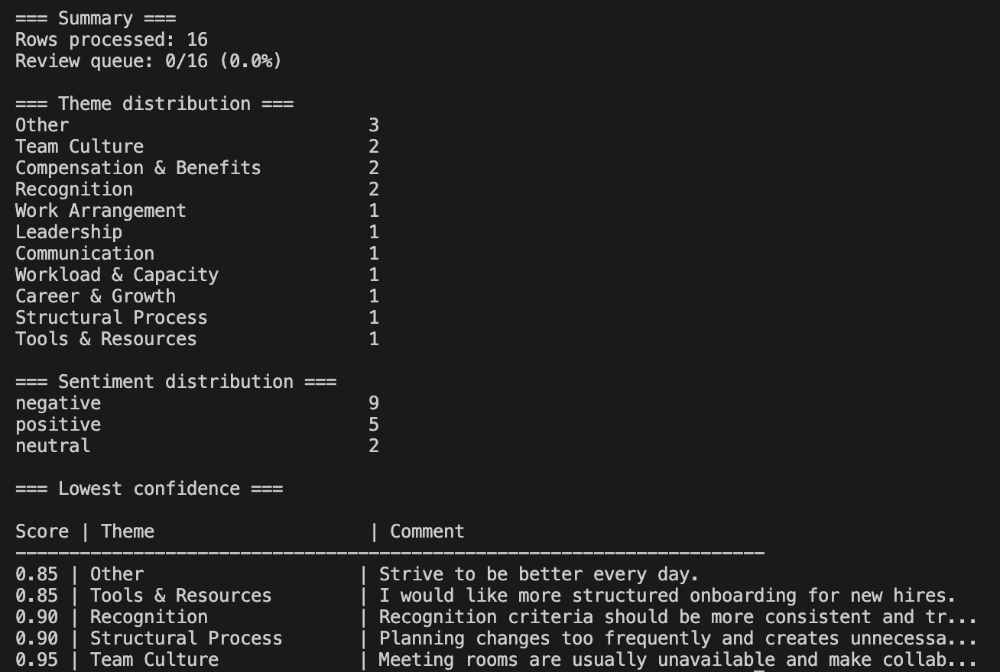

# LLM Feedback Classifier

An AI-assisted employee feedback classification pipeline powered by local LLMs through Ollama.

The project analyzes employee survey comments and automatically classifies them into predefined themes and sentiments while generating review queues for ambiguous responses.

## Features

- Local LLM inference using Ollama
- Configurable taxonomy and validation rules
- CSV-based survey processing
- Response validation layer
- Cache system for repeated classifications
- Review queues for:
  - Low-confidence classifications
  - Comments classified as `Other`
- Configurable through YAML files
- CLI overrides for experimentation

## Example Output



The classifier processes employee survey comments, assigns themes and sentiment labels, and highlights comments that may require manual review.

## Example Classification

### Input

| Topic | Question | Comment |
|---------|---------|---------|
| Work Environment | What would most improve your day-to-day working experience? | Being able to work remotely more often would make a significant difference. |

### Output

```json
{
  "primary_theme": "Work Arrangement",
  "secondary_theme": null,
  "sentiment": "negative",
  "confidence": 0.95,
  "needs_review": false
}
```

## Supported Themes

- Work Arrangement
- Career & Growth
- Leadership
- Communication
- Compensation & Benefits
- Structural Process
- Workload & Capacity
- Team Culture
- Tools & Resources
- Recognition
- Other

## Project Structure

```text
.
├── config/
│   ├── app.yaml
│   └── taxonomy.yaml
├── data/
│   ├── sample/
│   ├── cache/
│   └── output/
├── src/
│   ├── cache.py
│   ├── cli.py
│   ├── config_loader.py
│   ├── ollama_client.py
│   ├── pipeline.py
│   ├── prompts.py
│   ├── report.py
│   └── validator.py
├── requirements.txt
└── main.py
```

## Installation

Create a virtual environment:

```bash
python3 -m venv .venv
source .venv/bin/activate
```

Install dependencies:

```bash
pip install -r requirements.txt
```

## Requirements

- Python 3.11+
- Ollama
- A local model (tested with qwen2.5)

Example:

```bash
ollama pull qwen2.5
```

## Usage

Run the full dataset:

```bash
python3 main.py
```

Process only a subset:

```bash
python3 main.py --limit 10
```

Bypass cache reads:

```bash
python3 main.py --skip-cache
```

Enable debug output:

```bash
python3 main.py --debug all
```

Display the final configuration:

```bash
python3 main.py --show-config
```

## Output Files

| File | Description |
|--------|--------|
| pulse_output.csv | Full classification results |
| other_review.csv | Comments classified as `Other` |
| low_confidence_review.csv | Low-confidence classifications |
| cache.json | Classification cache |

## Design Goals

```text
CSV Input
    │
    ▼
Pipeline
    │
    ├── Prompt Builder
    │
    ▼
Local LLM (Ollama)
    │
    ▼
Validator
    │
    ├── Classified Results
    ├── Review Queue
    └── Low Confidence Export
```

The project intentionally separates:

- Prompt generation
- LLM inference
- Validation
- Caching
- Reporting
- Configuration

This structure makes experimentation and prompt iteration easier while keeping the classification pipeline deterministic and reviewable.

## Future Improvements

- Batch inference
- Async processing
- Markdown/HTML reports
- Interactive review dashboard
- Additional validation rules
- Multiple model support

## About

Built to automate employee feedback classification using local LLMs, configurable taxonomies, validation layers, and review workflows.